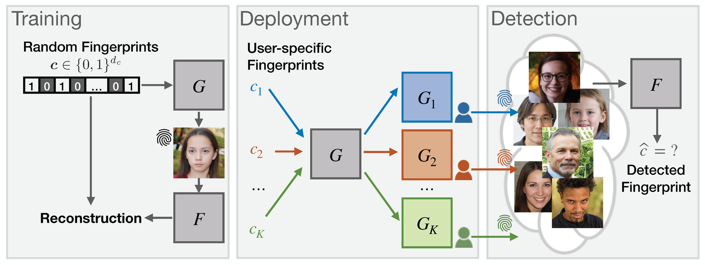

# Scalable GAN Fingerprints

### [Responsible Disclosure of Generative Models Using Scalable Fingerprinting](https://arxiv.org/pdf/2012.08726)
[Ning Yu](https://sites.google.com/site/ningy1991/)\*, Vladislav Skripniuk\*, [Dingfan Chen](https://cispa.de/en/people/dingfan.chen), [Larry Davis](http://users.umiacs.umd.edu/~lsd/), [Mario Fritz](https://cispa.saarland/group/fritz/) 
arXiv 2021

## Abstract
Over the past six years, deep generative models have achieved a qualitatively new level of performance. Generated data has become difficult, if not impossible, to be distinguished from real data. While there are plenty of use cases that benefit from this technology, there are also strong concerns on how this new technology can be misused to spoof sensors, generate deep fakes, and enable misinformation at scale. Unfortunately, current deep fake detection methods are not sustainable, as the gap between real and fake continues to close. In contrast, our work enables a responsible disclosure of such state-of-the-art generative models, that allows researchers and companies to fingerprint their models, so that the generated samples containing a fingerprint can be accurately detected and attributed to a source. Our technique achieves this by an efficient and scalable ad-hoc generation of a large population of models with distinct fingerprints. Our recommended operation point uses a 128-bit fingerprint which in principle results in more than 1036 identifiable models. Experiments show that our method fulfills key properties of a fingerprinting mechanism and achieves effectiveness in deep fake detection and attribution.

## Prerequisites
- Linux
- NVIDIA GPU + CUDA 10.0 + CuDNN 7.5
- Python 3.6
- tensorflow-gpu 1.14
- To install the other Python dependencies, run `pip3 install -r requirements.txt`.

## Datasets
- We experiment on six datasets. Download and unzip images into a folder.
  - [CelebA aligned and cropped images](https://drive.google.com/file/d/0B7EVK8r0v71pZjFTYXZWM3FlRnM/view?usp=sharing). All images for fingerprint autoencoder training. 150k/50k images for [ProGAN PyTorch](https://github.com/jeromerony/Progressive_Growing_of_GANs-PyTorch), [StyleGAN](https://github.com/NVlabs/stylegan), and [StylegGAN2](https://github.com/NVlabs/stylegan2) training/evaluation.
  - [LSUN Bedroom](https://github.com/fyu/lsun). All images for fingerprint autoencoder training. 50k/50k images for [ProGAN PyTorch](https://github.com/jeromerony/Progressive_Growing_of_GANs-PyTorch), [StyleGAN](https://github.com/NVlabs/stylegan), and [StylegGAN2](https://github.com/NVlabs/stylegan2) training/evaluation.
  - [LSUN Cat](http://dl.yf.io/lsun/objects/). All images for fingerprint autoencoder training. 50k/50k images for [ProGAN TensorFlow](https://github.com/tkarras/progressive_growing_of_gans), [StyleGAN](https://github.com/NVlabs/stylegan), and [StylegGAN2](https://github.com/NVlabs/stylegan2) training/evaluation.

